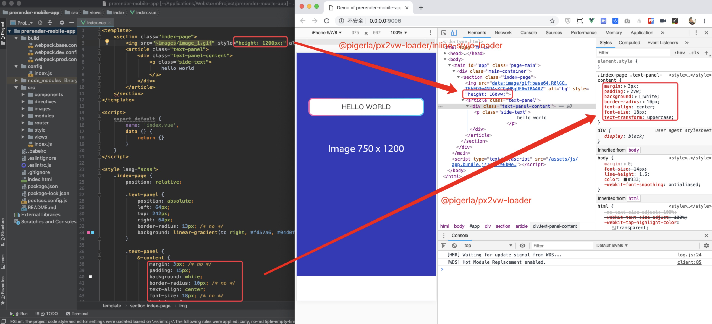

# px2vw-loader

Transform 'px' into 'vw' or 'rem'

## Demo



## Usage

### Install package

```bash
npm install --save-dev @pigerla/px2vw-loader
```

### Configuration

You can make some configuration in your `webpack.config.js` or `webpack.base.config.js` file optionally.

```js

// REMARK: '...' below means 'other configurations'

...
{
    test: /\.scss$/,
    ...,
    use: [
        ...,
        'css-loader',
        '@pigerla/px2vw-loader',  // 1. config here，optional
        ...
    ]
},
{
    test: /\.css$/,
    ...,
    use: [
        ...,
        'css-loader',
        '@pigerla/px2vw-loader',  // 2. config here，optional
        ...
    ]
}, 
{
    test: /\.vue$/,
    ...,
    loader: [
        'vue-loader', 
        '@pigerla/px2vw-loader/inline-style-loader.js' // 3. config here，optional
    ]
}
...
```

### Options

```js

// default options below
{
    // design size: 750px
    datum: 750,
    
    // multiple of outputUnit
    multiple: 100,

    // the unit of output
    outputUnit: 'vw',

    // precision
    precision: 6,

    // ignore keyword, like /* no */ in Sass or Less
    ignoreComment: 'no'
}
```

## Example

Example is here: [https://github.com/ImPigerla/prerender-mobile-app](https://github.com/ImPigerla/prerender-mobile-app)
