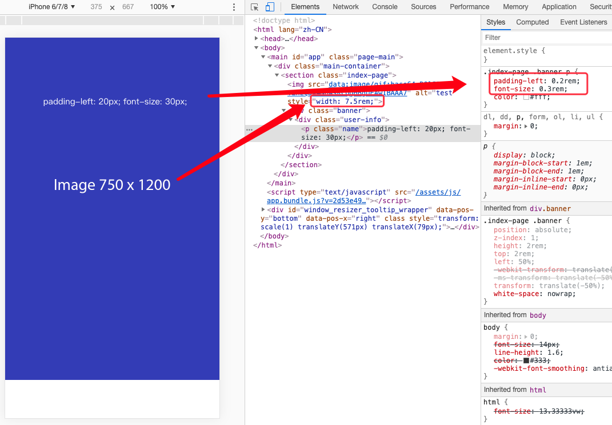

# px2vw-loader

Transform 'px' into 'vw' or 'rem'

## Demo 例子截图



## Usage

### Install package 安装

```bash
npm install --save-dev @pigerla/px2vw-loader
```

### Configuration 配置

You can make some configuration in your `webpack.config.js` or `webpack.base.config.js` file optionally.

在项目的webpack配置loaders项中设置如下配置

```js

// REMARK: '...' below means 'other configurations'

...
{
    test: /\.scss$/,
    ...,
    use: [
        ...,
        'css-loader',             // 插在css-loader前面
        '@pigerla/px2vw-loader',  // 1. config here，optional
        ...
    ]
},
{
    test: /\.css$/,
    ...,
    use: [
        ...,
        'css-loader',             // 插在css-loader前面
        '@pigerla/px2vw-loader',  // 2. config here，optional
        ...
    ]
}, 
{
    test: /\.vue$/,
    ...,
    loader: [
        'vue-loader',                                  // 插在css-loader前面
        '@pigerla/px2vw-loader/inline-style-loader.js' // 3. config here，optional
    ]
}
...
```

### Options

```js

// default options below
{
    // design size: 750px
    // 一般设计图尺寸
    datum: 750,
    
    // multiple of outputUnit
    // 缩放倍数
    multiple: 100,

    // the unit of output
    // 转为目标单位
    outputUnit: 'vw',

    // precision
    // 四舍五入小数点后6位
    precision: 6,

    // ignore keyword, like /* no */ in Sass or Less
    // 忽略转化的属性
    ignoreComment: 'no'
}
```


Good practice for the 'rem' unit's configuration 
比较佳样式实践如下

```scss
// global scss configuration 全局的scss/css样式

// html font-size 
html {
    font-size: (100 / 750 ) * 100vw;

    @media screen and (min-width: 750px) {
      font-size: 100px; /*no*/
    }
}

// set max-width and center
body {
    height: 100%;
    max-width: 750px;
    margin: 0 auto;
}
```

```js
// loader configuration
{
    loader: '@pigerla/px2vw-loader',
    options: {
        outputUnit: 'rem'
    }
}
```

## Example

Example is here: [https://github.com/ImPigerla/prerender-mobile-app](https://github.com/ImPigerla/prerender-mobile-app)
